# TCP/IP a ISO OSI
# ISO OSI
## Jak data kolují fyzicky v OSI modelu
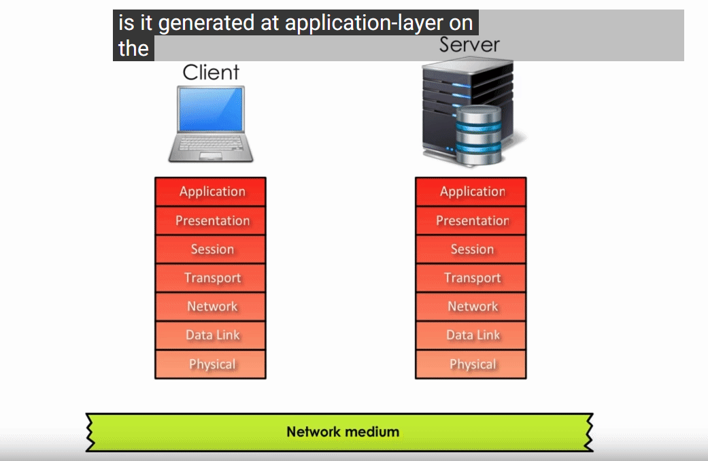
Kdyz odpoví server tak zas začne v aplikační vrstvě dolů a pak zas u klienta nahoru.
## Jak data kolují logicky(layer to layer) v OSI modelu
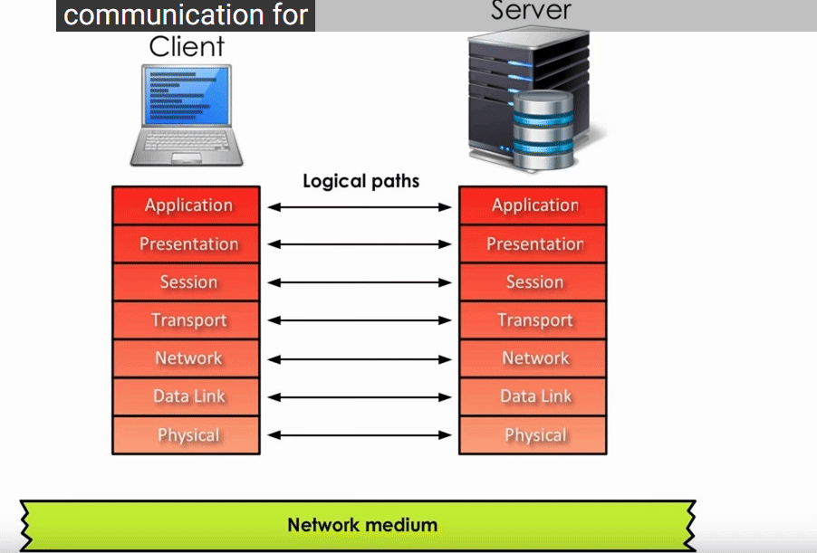
logicky je myšleno jak na sebe vrstva klienta a serveru reagují ( jeden zašifruje, druhej zas odšifruje atd)
# Aplikační vrstva
### netechnicky vysvětleno
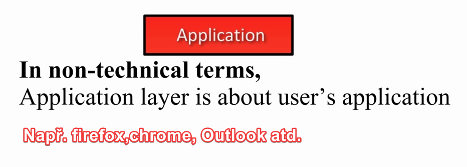
### technicky vysvětleno
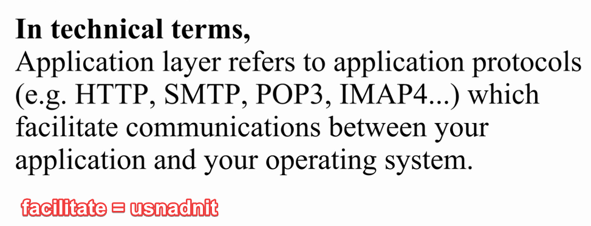
## Rozdíl ve vrstvách
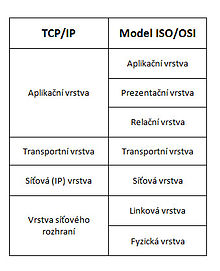
# Transportní vrstva
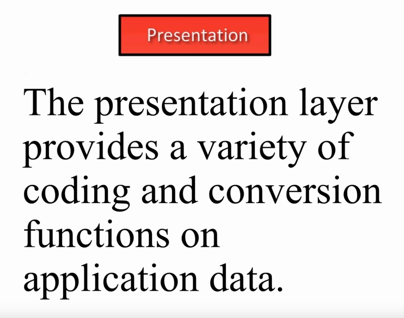
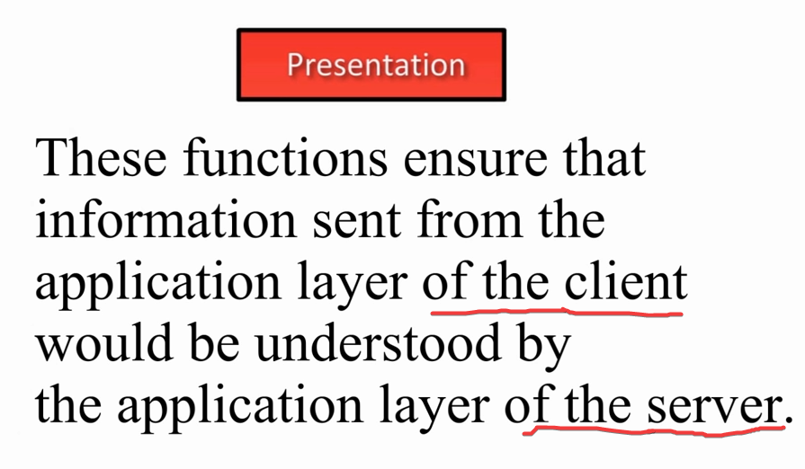
### jednoduše řečeno
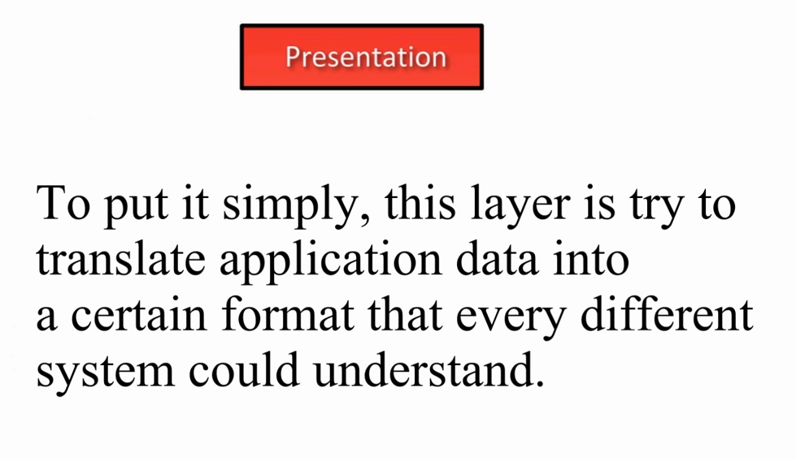
### Příklad:
1)pokud posílám obrázek do počítače mého přítele, musím použít některé standardní formáty jako gif nebo PNG, aby počítač mého kamaráda rozuměl.
2)pokud chci sdílet videa na YouTube, musím použít standardní formát jako mp4 nebo AV
### Shrnutí:
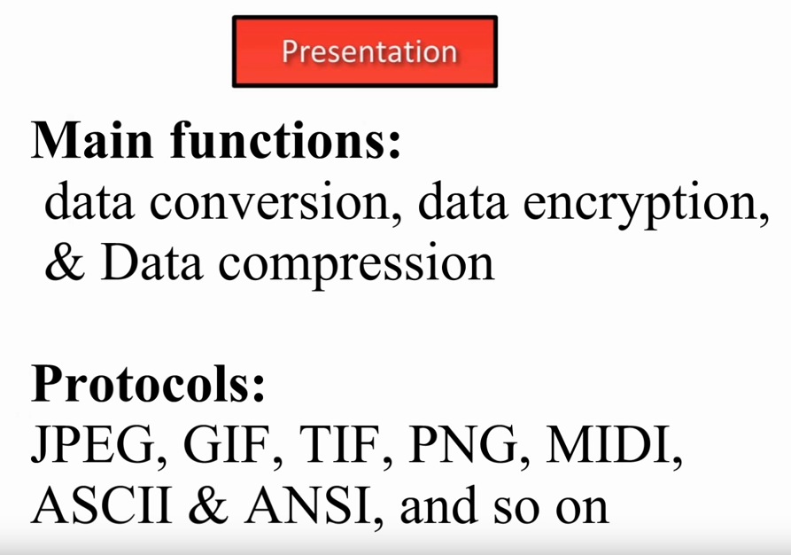
# Relační vrstva
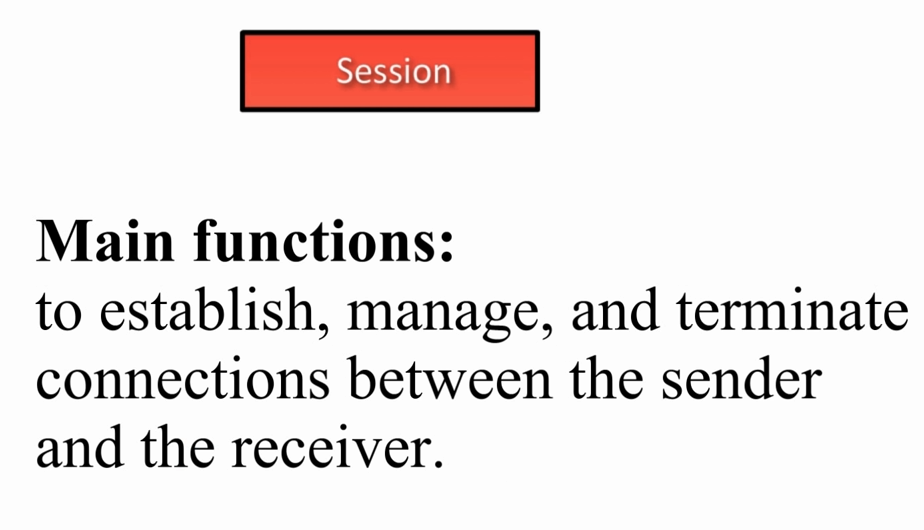
## Vysvětlení na příkladu:
nejlepším příkladem pro vysvětlení této vrstvy je
telefonní hovor, ve kterém:
1) Nejprve vytvoříte spojení
2) poté zahajte konverzaci
3) a poté ukončíte spojení
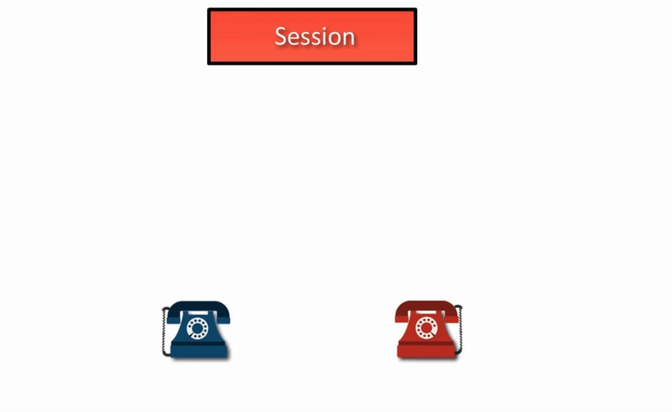
### Hlavní funkce vrstvy:

### Vysvětlení proč 5-7 vrstvy v OSI se stanou jednou vrstvou v TCP/IP

### Příklady zařízení který využívají jaký vrstvy
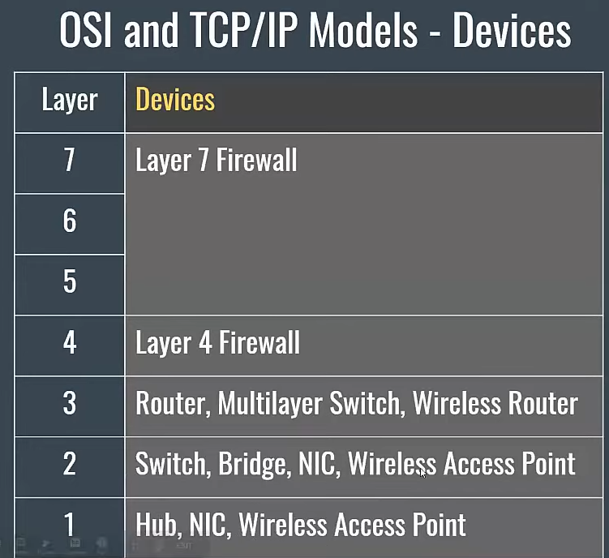
### Příklady protokolů který se využívají v jaký vrstvě
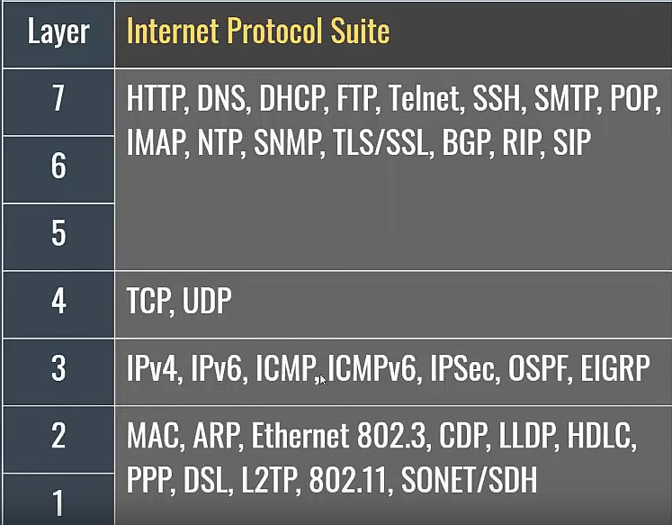
### Co první 3 vrstvy  dělájí (apl,prezen, relační)
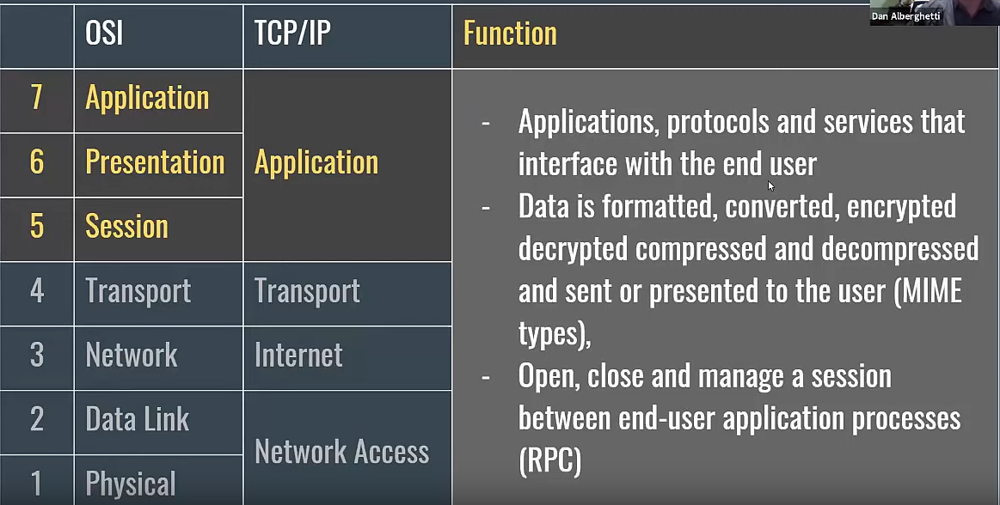

