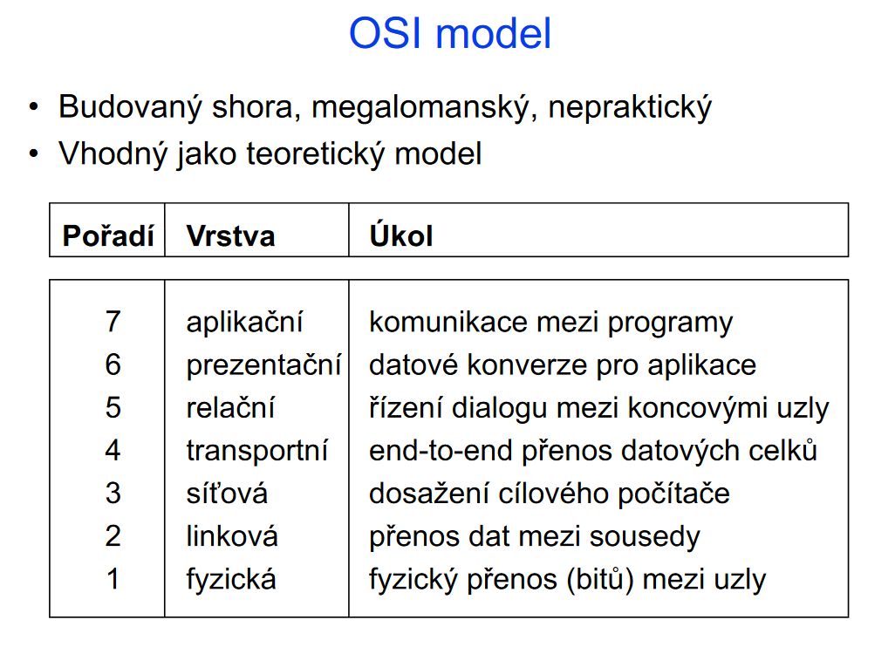
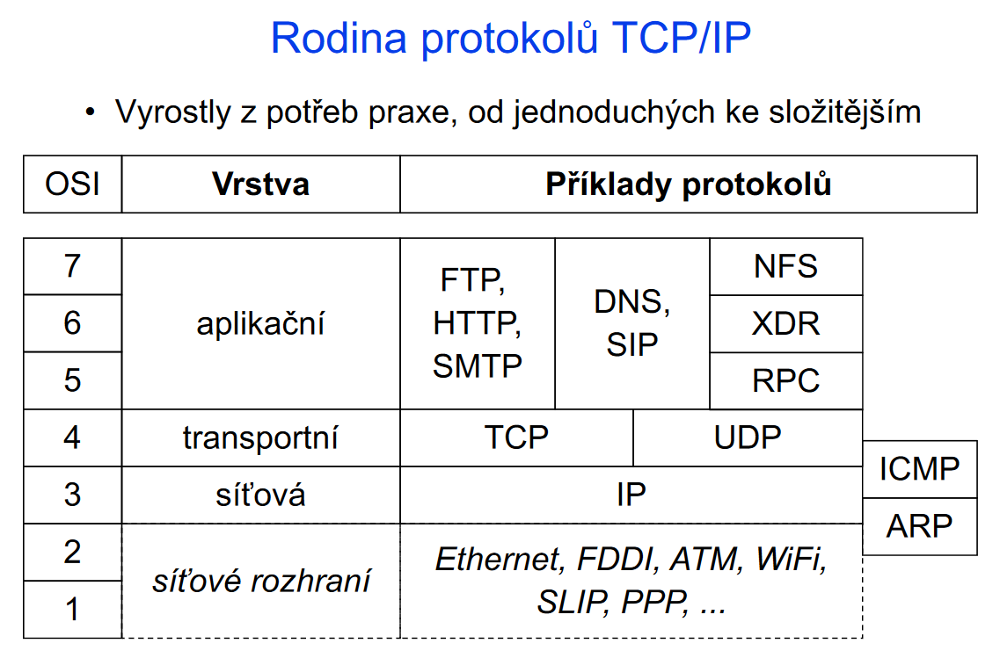

# TCP/IP a ISO OSI
# ISO OSI
## OSI MODEL

## Rodina protokolu TCP/IP

## Spojovan‚/nespojovan‚ sluzby
spojovanesluzby.png)
## Jak data koluj¡ fyzicky v OSI modelu

Kdyz odpov¡ server tak zas zacne v aplikacn¡ vrstve dolu a pak zas u klienta nahoru.
## Jak data koluj¡ logicky(layer to layer) v OSI modelu

logicky je mysleno jak na sebe vrstva klienta a serveru reaguj¡ ( jeden zasifruje, druhej zas odsifruje atd)
# Aplikacn¡ vrstva
### netechnicky vysvetleno

### technicky vysvetleno

## Rozd¡l ve vrstv ch

# Transportn¡ vrstva

### jednoduse receno

### Pr¡klad:
1)pokud pos¡l m obr zek do poc¡tace m‚ho pr¡tele, mus¡m pouz¡t nekter‚ standardn¡ form ty jako gif nebo PNG, aby poc¡tac m‚ho kamar da rozumel.
2)pokud chci sd¡let videa na YouTube, mus¡m pouz¡t standardn¡ form t jako mp4 nebo AV
### Shrnut¡:

# Relacn¡ vrstva

## Vysvetlen¡ na pr¡kladu:
nejleps¡m pr¡kladem pro vysvetlen¡ t‚to vrstvy je
telefonn¡ hovor, ve kter‚m:
1) Nejprve vytvor¡te spojen¡
2) pot‚ zahajte konverzaci
3) a pot‚ ukonc¡te spojen¡

### Hlavn¡ funkce vrstvy:

### Vysvetlen¡ proc 5-7 vrstvy v OSI se stanou jednou vrstvou v TCP/IP

### Pr¡klady zar¡zen¡ ktery vyuz¡vaj¡ jaky vrstvy

### Pr¡klady protokolu ktery se vyuz¡vaj¡ v jaky vrstve

### Co prvn¡ 3 vrstvy  del j¡ (apl,prezen, relacn¡)

